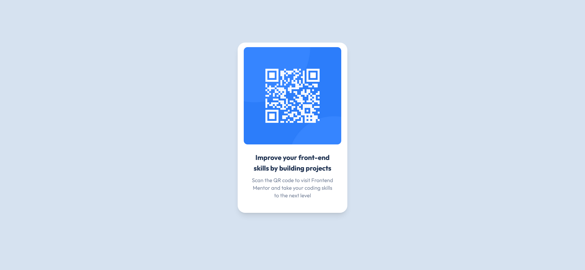

## Table of contents

- [Overview](#overview)
  - [Screenshot](#screenshot)
  - [Links](#links)
  - [Built with](#built-with)
  - [What I learned](#what-i-learned)
- [Author](#author)

## Overview

I've managed to resolve this challenge altough the sizes are a bit off.

### Screenshot

### Links

- Solution URL: 
- Live Site URL: 

### Built with

- [React](https://reactjs.org/) - JS library
- [Tailwind](https://tailwindui.com/) - For styles

### What I learned

I learned more about Tailwind, flexboxes and so many other things.

## Author

- Frontend Mentor - [@f1x3d49](https://www.frontendmentor.io/profile/f1x3d49)
